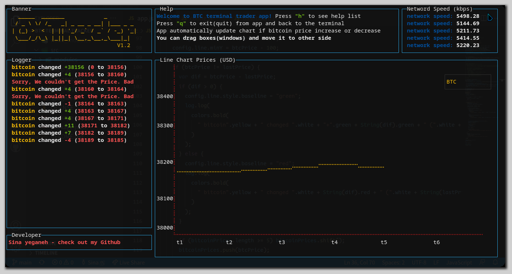
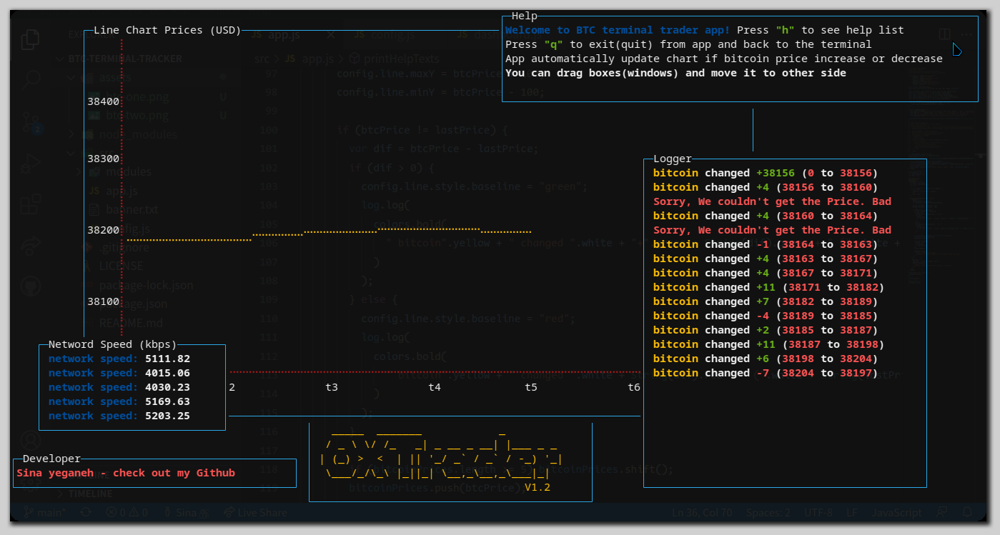

# BTC Terminal Tracker


**Bitcoin terminal tracker** is a terminal app which allow you to track bitcoin price from your terminal. In this version (`V1.2`) I changed its name to **OXTracker** 😄, this terminal app (maybe `tool`) have all of these features:

- **`Bitcoin` Price Chart** - this chart changed its `base-color` to `green` or `red` when bitcoin price increase or decrease.
- **Alert system** - notice you when bitcoin price changed or get error in `getCryptoPrice` process.
- **`Bitcoin` Logger** - print `bitcoinPrice` and how many it changed.
- **Network Speed** - check your network speed and log it in `networkSpeed` window(box).
- **Draggable Windows** - you can drag boxes or windows and move it to other side.

<p align="center">
  
  <h6 align="center">Sorry I take this screenshot when bitcoin price was stable 😅</h6>
</p>

### [Draggable Boxes]()
As you see, you can drag your box and move to other side, It's mean you can set your window as you want.
<p align="center">
  
</p>

## How It Works
**Run `OX Tracker` in just 3 steps:**

1- First clone and cd to that
```shell
git clone https://github.com/sina-yeganeh/btc-terminal-tracker.git && cd btc-terminal-tracker
```
2- Install all dependencies
```shell
npm install
```

3- Now you can run app
```shell
npm start
```

## Contributing
**All pull request are welcome!** Please explain what did u add to this app.

## License
[Apache License](./LICENSE) - *use code just with reference address is possible*

##### Last Update: `3/2/2022`
